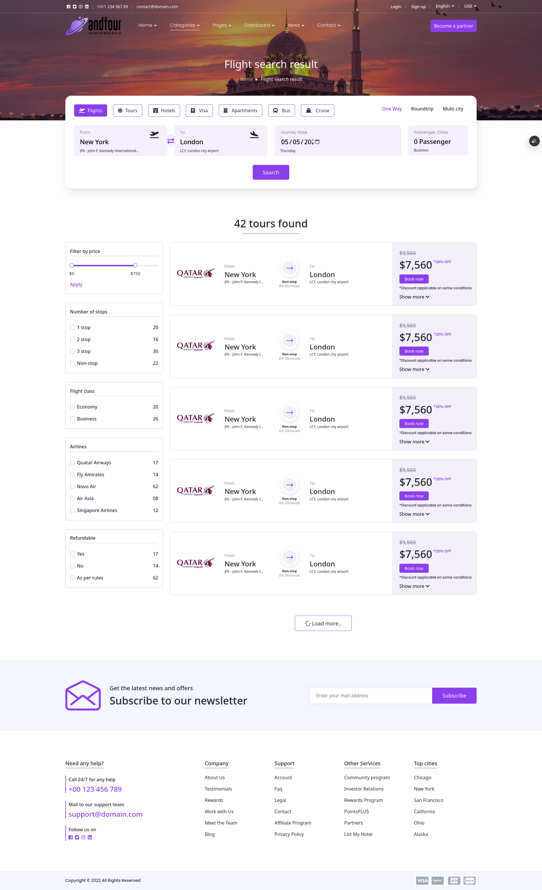
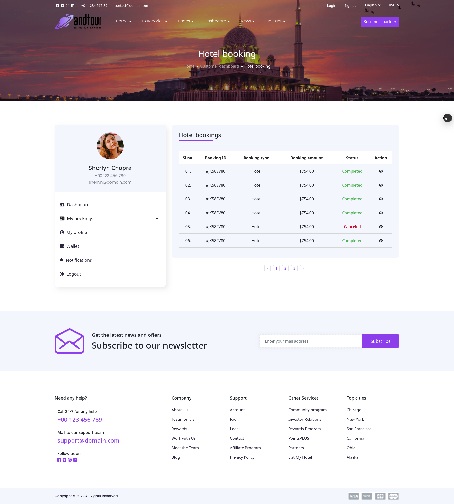
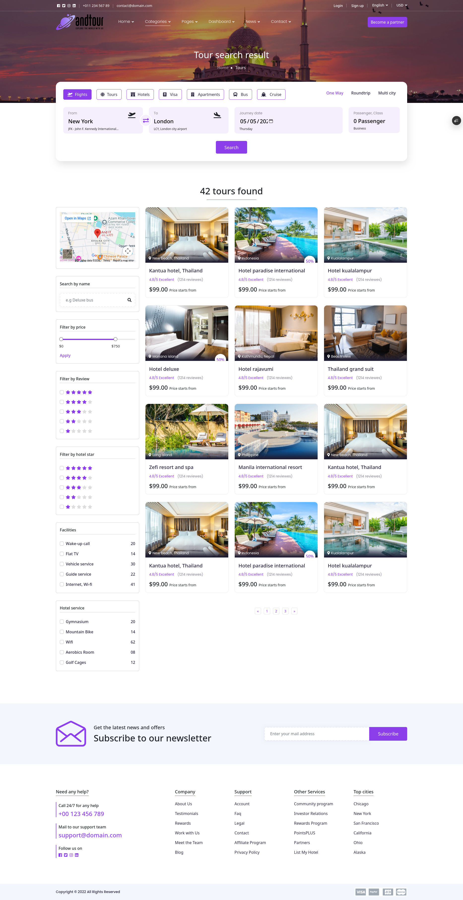

# Andtourtravel – Booking System Frontend

A modern, responsive **travel booking frontend** for an end-to-end booking experience across multiple travel categories such as **Flights, Tours, Hotels, Visa, Apartments, Bus, and Cruise**.  
The UI is designed to be user-friendly with clean navigation, search forms, destination discovery, booking pages, and account/dashboard features.

---

## 📌 Live Server

You can try the app here:

**Live Site:** `https://booking-systems-frontend-zeta.vercel.app/`

---

## ✨ Project Description

This frontend provides the main user experience for travelers, including:

- Home page with featured deals and top destinations  
- Booking flows for multiple categories:
  - Flight search + booking
  - Hotel search + booking
  - Tour booking
  - Visa application + details
  - Apartment booking and details
  - Bus booking
  - Cruise booking
- Pages for:
  - About, Team, Testimonials, FAQ
  - Booking confirmation
  - Booking history
  - Wallet
  - Notifications
  - News + news details
  - Authentication pages (Login, Register, Forget Password, Verify OTP, Reset Password)
- Responsive layout with consistent design across all sections

---

## 🧰 Tech Stack

- **HTML** (97%)
- **CSS** (2.5%)
- **JavaScript** (0.5%)

> This project is a mostly static frontend with JavaScript used where needed for interactive UI behavior.

---

## 🗂️ Project Structure (Pages)

The repository contains many ready-to-use pages, including:

- `index.html` (Home)
- Booking pages such as:
  - `flight-booking.html`
  - `hotel-booking.html`
  - `tour-booking.html`
  - `room-booking.html`
  - `bus-booking.html`
  - `cruise-booking.html`
  - `visa-application.html`
- Search / details pages such as:
  - `flight-search-result.html`
  - `hotel-details.html`
  - `tour-details.html`
  - `apartment-details.html`
- User area pages such as:
  - `dashboard.html`
  - `booking-history.html`
  - `my-profile.html`
  - `wallet.html`
  - `notification.html`
- Informational pages such as:
  - `about.html`
  - `faq.html`
  - `privacy-policy.html`
  - `terms-service.html`
- Error page:
  - `error.html`

---

## 📷 Website Screenshots

> Add your screenshots here.

### Home


### Flights


### Hotels


### Tours


### Booking Confirmation


---

## 🚀 How to Run Locally

1. Clone the repository:
   ```bash
   git clone https://github.com/Islam412/Booking-System-frontend.git

